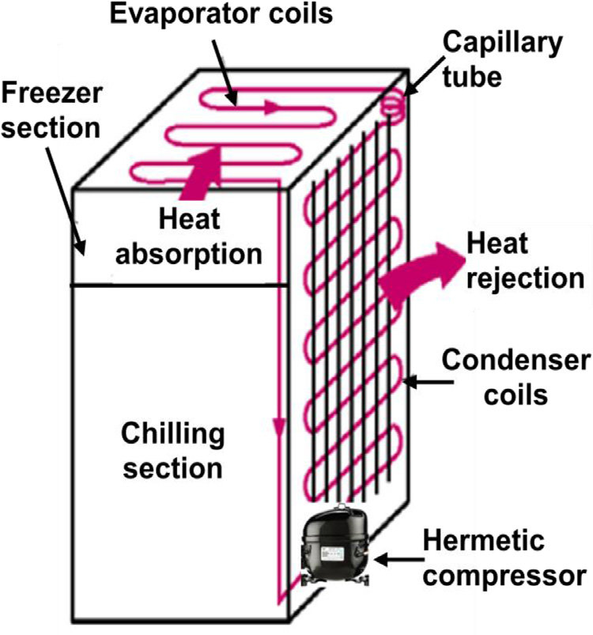

  
  

  <em>Figure 1.</em> A Danby DAR044A6BSLDBO mini-fridge.

  
  

  <em>Figure 2.</em> Schematic Design sourced from https://ecircuitdiagrams.blogspot.com/2024/11/circuit-diagram-refrigerator-fridge.html.

  The mini fridge, as shown in Fig. 1, functions by rejecting heat from its interior to the outside environment, thereby keeping the interior cool. Inside, the fridge is a refrigerant which travels through a closed loop and is capable of easily switching between liquid and gaseous states. The process begins when the refrigerant passes through the evaporator coils, pictured in Fig. 2, and absorbs heat from the inside of the refrigerator, transforming the refrigerant into vapor. Next, the compressor uses electric power in order to compress the vapor. This process increases the temperature and pressure of the refrigerant. Then, as the refrigerant goes through the condenser coils, it loses heat and turns back into a liquid. The capillary tube, pictured in the diagram, decreases the pressure of the liquid, further lowering its temperature.

  
  

  <em>Figure 3.</em> A control volume diagram of the closed loop cycle.

  The refrigerator shown above uses 90 W of power to its compressor, per its specifications sheet, and 22g of R600A refrigerant. Based on the cycle diagram, the refrigerant is in the saturated vapor state before entering the 

  In order to improve the cycle efficiency, the refrigerator could be changed to have a dual cycle setup for which the two cycles are connected by a heat exchanger that replaced one of the cycle's evaporator and the other cycle's condenser. In this setup, each cycle would operate under a different temperature range. Thus, the refrigerants would be chosen based upon that information, and more specific choices of refrigerants can allow for lower minimum temperatures. In addition, by breaking up the cycle into two cycles, the compressors also do not need to do as much work as the single compressor in the original setup resulting in less work input. Thus, the efficiency can be improved. Lower pressures will also result in less mechanical stress which can improve the durability of the refrigerator.

